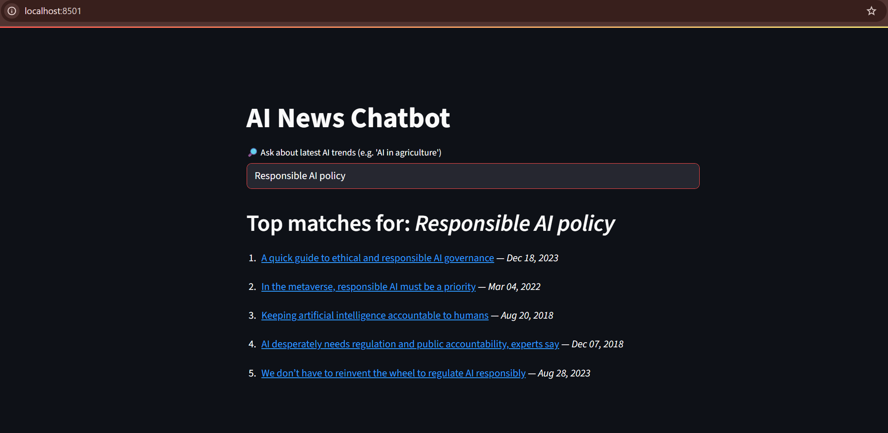
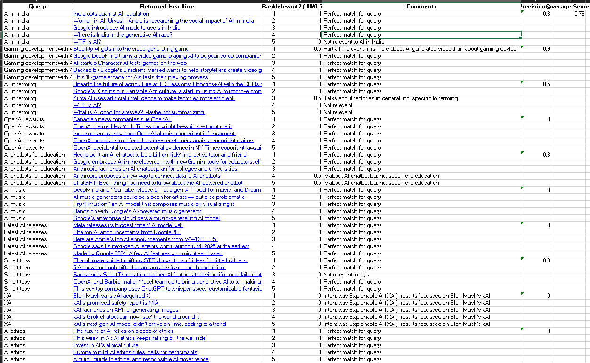

# AI News Trend Chatbot

This is a **prototype semantic search chatbot** that crawls AI-related news headlines, generates embeddings using a Sentence Transformer, and matches them to user queries in real time.

---

## **Project Goal**
Stay up to date with the latest **AI news** by searching across 9,000+ headlines with a natural language query.  
It helps surface the **most relevant** and **freshest** articles automatically.

---

## **How it works**

1. **Web Scraper (`news_scrape.py`)**
   - Crawls TechCrunch’s AI news section.
   - Stores headlines, links, and dates to `news_scrape.csv` and `headlines.parquet`.
   - Generates embeddings inline and updates the `FAISS` index (`news.index`).

2. **Semantic Search**
   - Uses a `SentenceTransformer` (`all-MiniLM-L6-v2`) for embeddings.
   - Uses `FAISS` to perform fast similarity search.
   - When a user asks a question (e.g., *"AI in agriculture"*), the chatbot retrieves top matches based on **cosine similarity**.

3. **Frontend**
   - Runs in **Streamlit** for a simple chatbot-style query UI.
   - Displays headlines + direct links + publish dates.

---

## **Accuracy**

- **Average relevance score:** `0.78` (out of 1.0)  
- **Precision@5:** ~80% for most queries.
- Covers **direct queries**, **broad queries**, and **ambiguous cases** (`XAI`, `Smart toys`).
- Full details: see [`accuracy_report.md`](./accuracy_report.md) and [`accuracy_report.xlsx`](./accuracy_report.xlsx)

---

## Demo Screenshot

### 🔹 Chatbot UI


### 🔹 Accuracy Report



## **Key folders & files**

| File | Purpose |
|------|---------|
| `news_scrape.py` | Scrapes headlines, deduplicates, saves to `.csv` + `.parquet` |
| `chatbot.py` | Streamlit app for user queries |
| `headlines.parquet` | Stores headlines with metadata |
| `news.index` | Saved `FAISS` index for fast similarity search |
| `accuracy_report.xlsx` | Manual test results with relevance scoring |
| `accuracy_report.md` | Summary of search accuracy |

---

## **How to run**

```bash
# Install requirements
pip install -r requirements.txt

# Scrape & build index
python news_scrape.py

# Launch chatbot
streamlit run chatbot.py

```

## **What’s next**

- Add longer article snippets for richer context to improve semantic matching.
- Use domain-specific LLM embeddings or fine-tuned models for AI news language.
- Integrate user feedback signals -e.g., clicks, upvotes, to fine-tune similarity over time.
- Expand the source beyond TechCrunch to cover broader AI industry updates.
